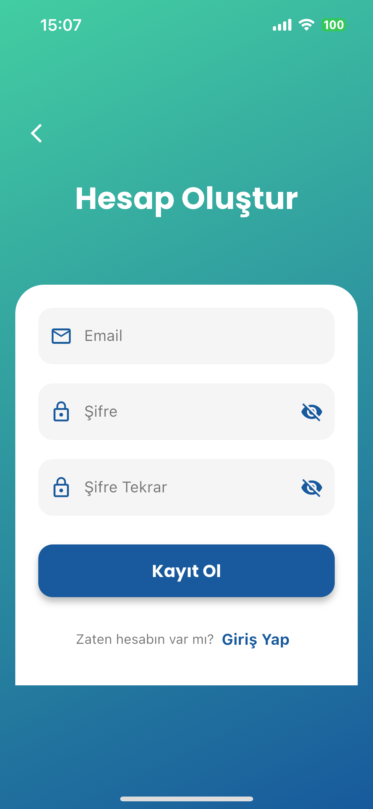

# Firebase Chat

A real-time chat application built with Flutter and Firebase, featuring user authentication, real-time messaging, and profile management.

## Features

- User Authentication (Email/Password and Google Sign-in)
- Real-time messaging
- Image sharing
- Message status indicators (sent, delivered, read)
- User online/offline status
- Profile customization
- Message management (edit, delete)
- Chat history

## Technologies Used

### Frontend
- Flutter 3.0+
- Stacked Architecture
- Cached Network Image
- Image Picker
- Gallery Saver Plus
- Google Fonts
- Animate.do
- Emoji Picker Flutter
- IntL

### Backend & Services
- Firebase
    - Authentication
    - Cloud Firestore
    - Cloud Messaging (FCM)
    - Core
- Supabase
    - Storage
    - Client SDK

### Architecture & State Management
- Stacked Architecture
    - MVVM Pattern
    - Dependency Injection
    - Service Locator
    - Reactive State Management
- Stacked Services
    - Navigation
    - Dialog
    - Bottom Sheet
    - Snackbar

### Development Tools
- Android Studio / VS Code
- Git
- Dart DevTools
- Flutter SDK

## Requirements

- Flutter SDK 3.0 or higher
- Firebase project
- Supabase project
- Android Studio / VS Code

## Setup

1. Clone the repository:
   bash
   git clone https://github.com/furkansemiz/firebase_chat.git

2. Install dependencies:
   bash
   flutter pub get

3. Configure Firebase:
    - Create a new Firebase project
    - Add Android/iOS apps in Firebase console
    - Download and add google-services.json/GoogleService-Info.plist
    - Enable Authentication providers (Email/Password and Google)

4. Configure Supabase:
    - Create a new Supabase project
    - Update credentials in main.dart:
      dart
      await Supabase.initialize(
      url: 'YOUR_SUPABASE_URL',
      anonKey: 'YOUR_SUPABASE_ANON_KEY',
      );

5. Run the app:
   bash
   flutter run

## Architecture

The app follows the Stacked architecture pattern with:
- Views: UI components
- ViewModels: Business logic
- Services: Data and API handling
- Models: Data structures
- Firebase/Supabase: Backend services

## Features in Detail

### Authentication
- Email/Password registration and login
- Google Sign-in integration
- Password reset functionality

### Messaging
- Real-time message updates
- Image sharing support
- Message status tracking
- Message editing and deletion
- Read receipts

### Profile Management
- Profile picture upload
- User status updates
- Last seen tracking
- Profile information editing
